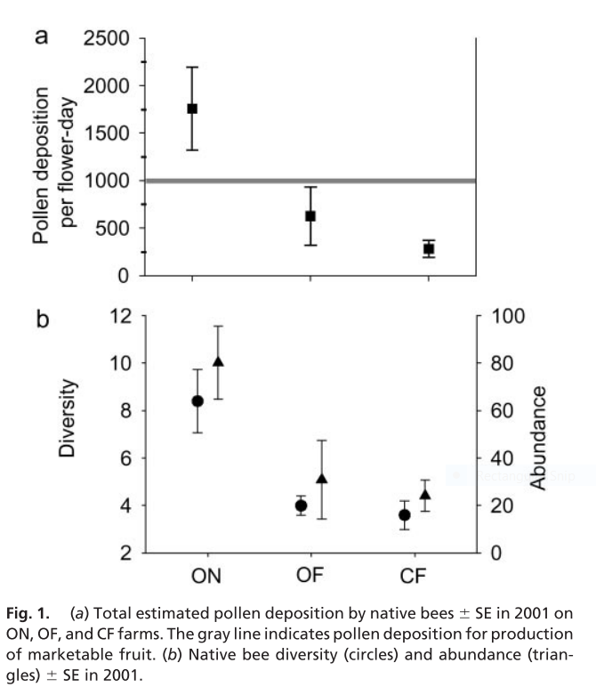

For assignment 1, I chose a figure from Kremen, Williams and Thorp (2002) "Crop pollination from native bees at risk from agricultural intensification". This study documented the contributions of individual pollinator species and aggregate communities to crop pollination on farms that varied by their proximity to natural habitat and their management type. Kremen *et al.* (2002) stress that agricultural intensification has pushed farmers to rely on managed honey bees (*Apis mellifera*); however, relying entirely on managed honeybees is becoming increasingly unpractical as *A. mellifera* numbers decline from a combination of disease and insecticide poisoning. Kremen *et al.* (2002) propose that agricultural practices that support diverse wild pollinator communities could encourage wild pollinators to pollinate crops instead.  

This study was set in the Central Valley and the eastern edge of the Coast Range of Yolo County, California and focused on watermelon. Watermelon was chosen because it requires multiple bee visits to produce marketable fruit. The farms were categorized as conventional farms or organic and either near or far from natural habitat. At each site, researchers measured pollen deposition by presenting newly opened flowers to individual bees within the fields. Once the flower was visited, it was closed off using bridal veil and stigmas were excised the next day. 

The first figure in this study illustrates the total estimated pollen deposited by native bees.  

#Caption in square brackets - change later 

